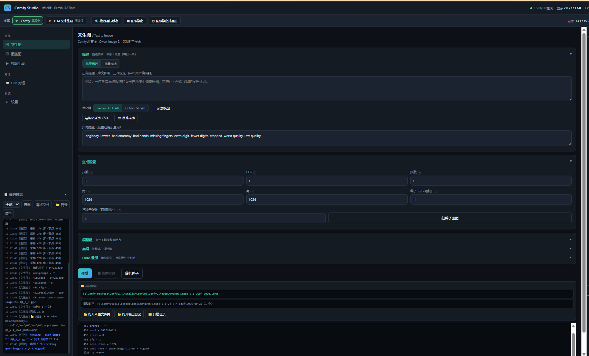
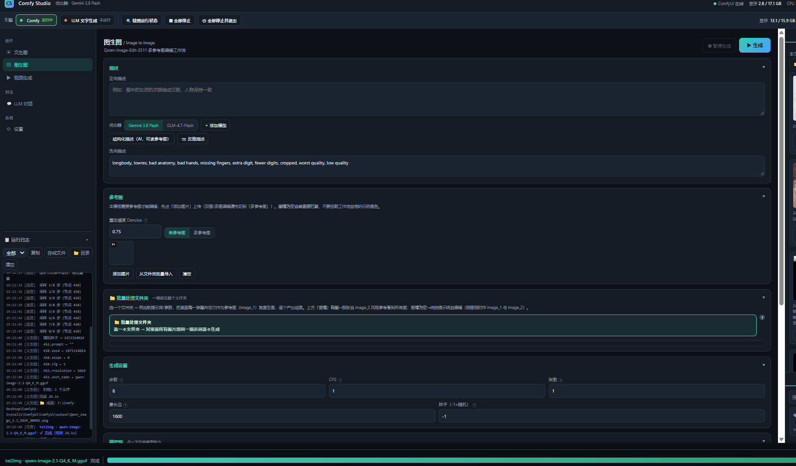
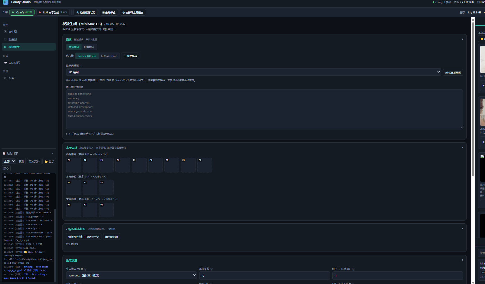

<div align="center">

# Comfy 第三方前端

**给 ComfyUI 套上一个「中文 · 零依赖 · 纯本地」的一体化网页工作台**

文生图 · 图生图 · AI 视频（MiniMax-H3）· 提示词优化 · 大模型对话 —— 全在一个界面里

[](https://www.python.org/)
[](#-快速开始)
[](#-license)
[](#-它是怎么做的)
[](#-隐私)

</div>

---

## 这是什么

一个跑在你自己电脑上的网页工作台。后端只用 **Python 标准库**（不装框架、不装 ORM），前端是 **一个 HTML 文件**（不打包、不编译）。启动后会自动用你日常的 Chrome 打开 `http://127.0.0.1:8777`，书签、扩展、登录态都在，上手即用。

它**不是** ComfyUI 的替代品 —— ComfyUI 仍然是真正的绘图/视频引擎，本项目是它前面那一层「人话界面」：

- ComfyUI 的节点工作流 → 变成填几个框、点一下「生成」；
- 英文专业提示词 → 交给内置的**提示词优化器**（本地模型或云端 API 都行）；
- 一堆散落在 `output/` 里的文件 → 自动按「模块 / 模型 / 日期」归档；
- 多引擎抢显存 → 内置**显存互斥**，同一时刻只跑一个引擎。

## 📸 界面截图

> 截图取自实机运行（Windows + RTX 5060 Ti 16GB）。

### 1️⃣ 文生图 —— 中文描述直接出图



左侧是常驻的**运行日志**（可按 任务 / 采样进度 / 图像 / 视频 / 对话 / 引擎 过滤），右侧实时回显 ComfyUI 的采样进度、随机种子、分辨率与成品路径。

### 2️⃣ 图生图 / 多图编辑 —— 给图 + 说要求



支持单图编辑、**多参考图**（`图片1`、`图片2`… 可在提示词里引用）、以及**批量处理文件夹**（一个文件夹里所有图用同一句提示词逐个处理）。

### 3️⃣ 视频生成 —— MiniMax-H3，带音轨



内置 **H3 模板**（首尾帧定义 / 分镜规划 / 视觉风格描述 / 镜头运动），支持「图 + 文 → 视频」参考模式，**16GB 显存实测可跑**。单次出 4~15 秒带声音的短视频；长片按「分镜 → 逐段生成 → 拼接」来做，完整流程见 [保姆级教程 · 第 12 章](docs/保姆级教程.md)。

## ✨ 特性

| | 说明 |
| --- | --- |
| 🇨🇳 **全中文界面** | 从按钮到报错都是中文，日志也做了术语中文化（`stream` → 流式、`TTFB` → 首字节） |
| 📦 **零构建、零框架** | 后端纯标准库，前端单 HTML 文件。改 `.html` 刷新即生效，改 `.py` 重启即生效 |
| 🔒 **数据 100% 本地** | 不上传、不联网、不埋点。只有你主动填了云端 API 时，那部分请求才走外网 |
| 🧠 **提示词优化器** | 一句大白话 → 专业绘图/视频提示词。可接本地模型（llama.cpp / Ollama）或任意 OpenAI 兼容 API |
| 💬 **大模型对话** | 支持拖拽图片/文本附件，长对话**自动压缩**上下文 |
| 🎬 **H3 视频专章** | 六段式提示词写法、镜头时间标注、声音内联、参考图用法，全部写进教程 |
| ⚡ **显存互斥** | 多个引擎（ComfyUI / LLM）不会同时抢显存，自动仲裁 |
| 🗂 **自动归档** | 生成物按「模块 / 模型 / 日期」自动归档，并提供「打开输出目录 / 归档目录」 |
| 🤖 **对 AI 友好** | 代码有函数级注释、目录结构清晰、教程里专门写了「让 AI 接管页面」的 CDP 方法 |

## 🚀 快速开始

### 前置条件

| 必备 / 可选 | 名称 | 说明 |
| --- | --- | --- |
| ✅ 必备 | **Windows 10 / 11（64 位）** | 启动脚本是 `.bat`，面向 Windows 调优 |
| ✅ 必备 | **Python 3.11+** | 安装时务必勾选 **Add python.exe to PATH** |
| 🔶 绘图必装 | **ComfyUI** + **comfy-cli** | `pip install comfy-cli` |
| 🔶 绘图需要 | **NVIDIA 显卡** + 模型文件 | 8GB 能玩小模型；16GB 可跑 H3 视频 |
| ⬜ 可选 | **llama.cpp / Ollama** | 想用本地大模型对话才需要 |
| ⬜ 可选 | **一个 OpenAI 兼容 API Key** | 提示词优化 / 云端对话（DeepSeek / GLM / Gemini 免费额度即可） |

> **最小可用**：只想用「提示词优化 + 云端对话」，**只要 Python + 一个 API Key**，不需要显卡、不需要 ComfyUI。

### 四步跑起来

```text
第 1 步：装 Python 3.11+（勾选 Add python.exe to PATH）
第 2 步：把本项目解压到任意目录，例如 D:\ComfyFrontend
第 3 步：双击 启动Comfy第三方前端.bat
第 4 步：页面自动打开 → 顶栏「＋ 添加模型」→ 填 API 地址与 Key → 保存
        → 此时「提示词优化」和「云端对话」已经能用了
```

想真的画图 / 生成视频，继续看 [保姆级教程](docs/保姆级教程.md) 第 5~8 章（装 ComfyUI、放模型、改配置）。

### 启动器参数

```bat
启动Comfy第三方前端.bat                :: 默认：起后端 + 用日常 Chrome 开一个应用窗口
启动Comfy第三方前端.bat --tab          :: 用系统默认浏览器开普通标签页
启动Comfy第三方前端.bat --no-browser   :: 只起后端，不弹浏览器（调试用）
启动Comfy第三方前端.bat --stop         :: 停掉正在跑的后端
```

关闭页面后，后端会在心跳超时（默认 120 秒）后**自动退出**，不会留后台僵尸进程。

## ⚙️ 配置

全部配置集中在 **`comfy_studio_config.json`**（和脚本同目录）。改完保存 → 重启 `启动Comfy第三方前端.bat` 生效。

配置里所有 `X:\...` 开头的路径都是**占位符**，意思是「换成你自己机器上的真实目录」：

| 字段 | 含义 | 例子 |
| --- | --- | --- |
| `engines_launch.comfy.exe` | 你的 ComfyUI 的 python.exe | `D:\ComfyUI\venv\Scripts\python.exe` |
| `engines_launch.comfy.cwd` | 你的 ComfyUI 根目录 | `D:\ComfyUI` |
| `model_dirs.unets` | 底模目录 | `D:\ComfyUI\models\diffusion_models` |
| `model_dirs.loras` | LoRA 目录 | `D:\ComfyUI\models\loras` |
| `listen_port` | 后端端口 | 默认 `8777` |
| `app.browser_mode` | 浏览器模式 | `daily`（日常 Chrome）/ `system` / `isolated`（带 CDP 调试口） |

> **不想手改 JSON？** 打开页面 → **设置 → 依赖自检**，缺什么按提示补；模型也可以直接在界面里「＋ 添加模型」填。
> 本文件里所有 `api_key` 都是空的，**API Key 建议在界面「设置」里填**，不要写进要分享的配置文件。

**最小修改集**（只有 3 处）：

1. `engines_launch.comfy.enabled` 改 `true`，`exe` / `cwd` 改成你的 ComfyUI 路径；
2. `model_dirs.unets` / `model_dirs.loras` 改成你的模型目录；
3. 打开页面 → 设置 → 依赖自检，缺什么补什么。

## 📁 目录结构

```text
Comfy第三方前端/
├── 启动Comfy第三方前端.bat     # 【入口】双击即起后端 + 开浏览器
├── comfy_studio.py            # 【后端】纯标准库 HTTP 服务：路由、生图、H3 视频、对话流式、配置读写
├── comfy_studio.html          # 【前端】单文件界面：所有页面 / 按钮 / 弹窗 / 日志
├── comfy_studio_launch.py     # 【启动器】无黑框起后端 + 按模式开浏览器 + 页面生命周期管理
├── comfy_control.py           # 【ComfyUI 驱动】工作流 UI→API 转换、提交、轮询、状态探测
├── comfy_engine.py            # 【引擎管理】启停 / 互斥 / 显存仲裁 / 真实状态检测
├── comfy_studio_config.json   # 【配置】你要改的就是它
├── requirements.txt           # 依赖说明（只有绘图需要 comfy-cli）
├── docs/保姆级教程.md          # 【完整教程】从装 Python 到 H3 视频，含排错与实测记录
├── screenshots/               # 界面截图
├── workflows/                 # 自带的 ComfyUI 工作流（可换成你自己的）
├── output/  archive/          # 出图出片目录 / 归档目录（运行时生成）
└── logs/  data/               # 运行日志 / 运行时数据（排错先看 logs）
```

> 想深入二次开发或让 AI 接手，看 [保姆级教程 · 第 15 章「代码结构」](docs/保姆级教程.md)。

## ❓ 常见问题

<details>
<summary><b>双击 bat 没反应 / 闪一下就没了</b></summary>

先确认 Python 装了且勾了「Add python.exe to PATH」。还是不行就绕开 bat，用命令行直接跑：

```bat
python comfy_studio_launch.py --no-browser
```

能起来说明是 bat 的问题；起不来会直接打印报错原因。
</details>

<details>
<summary><b>端口 8777 被占用</b></summary>

多半是上次的后端没退干净。双击 `启动Comfy第三方前端.bat --stop`，或改配置里的 `listen_port`。
</details>

<details>
<summary><b>显存显示 `–`，ComfyUI 显示「未运行」</b></summary>

这是**正常状态**：ComfyUI 没启动时读不到显存。点顶栏的 `Comfy` 按钮启动引擎即可。
</details>

<details>
<summary><b>文生图报错说缺 comfy-cli</b></summary>

`pip install comfy-cli`。注意要装在**跑后端的那个 Python** 里，装到 ComfyUI 自己的 venv 里没用（页面「设置 → 依赖自检」会告诉你是哪个 Python）。
</details>

<details>
<summary><b>能装在中文目录下吗？</b></summary>

**能。** 实测 `D:\_zt\Comfy第三方前端\` 这种中文目录下正常启动。
</details>

更多排错见 [保姆级教程 · 第 13 章](docs/保姆级教程.md)。

## 🔒 隐私

- **默认不出网**：后端只监听 `127.0.0.1`，不上传任何数据、不含任何统计/埋点。
- **只有你主动配置云端 API 时**，提示词优化 / 对话的请求才会发到你自己填的那个地址。
- 用本地模型（llama.cpp / Ollama）时，**从输入到输出全程不出本机**。
- 本项目**不含任何 API Key**。所有 `api_key` 字段默认为空，请在界面「设置」里填。

## 🗺 Roadmap

- [x] 文生图 / 图生图 / 多图编辑 / 批量文件夹处理
- [x] MiniMax-H3 视频（含音轨）+ H3 模板库
- [x] 提示词优化器（多供应商）+ 长对话自动压缩
- [x] 引擎显存互斥 + 页面心跳自动退出
- [ ] 工作流可视化编辑器
- [ ] 出图历史 / 画廊检索
- [ ] 一键安装脚本（Python + ComfyUI + comfy-cli）

## 🙏 致谢

- [ComfyUI](https://github.com/comfyanonymous/ComfyUI) —— 真正的绘图 / 视频引擎
- [llama.cpp](https://github.com/ggml-org/llama.cpp) —— 本地大模型推理
- [MiniMax-H3](https://github.com/MiniMax-AI) —— 带音轨的视频生成模型

## 📄 License

[MIT](LICENSE) © 2026 seeyouagain-laoda

本项目只提供界面与编排逻辑，不包含任何模型权重。模型的使用请遵守各自的开源协议。
